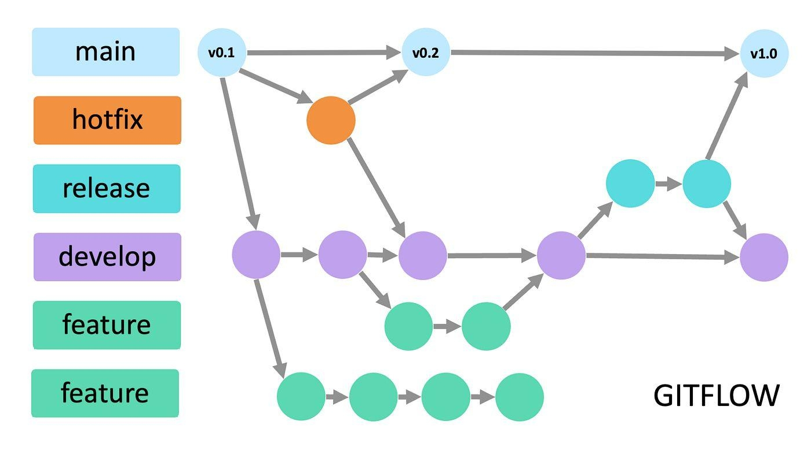

# Trabajo Práctico: Sistema de Gestión para Parques Nacionales

## Asignatura: 3641 – Bases de Datos Aplicada

**Comisión:** 02-5600

**Día y turno:** Viernes tarde

**Grupo:** 01

**Integrantes:**

* Barreto, Lautaro Agustín
* Losada Martínez, Agustina
* Miranda, Guillermo
* Villar, Facundo Agustín

# Flujo de trabajo: Gitflow

* Master: Contiene la versión más estable del sistema
* Develop: Junta los cambios incrementales de features que se publicarán en Master una vez estables
* Feature Branches: ramas donde desarrollamos las funcionalidades independientes del sistema

 

